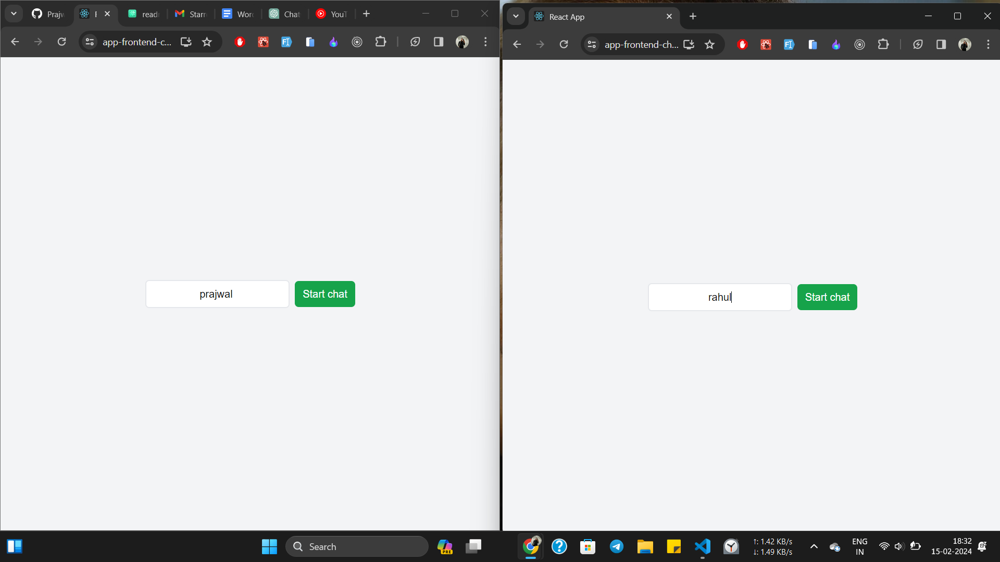
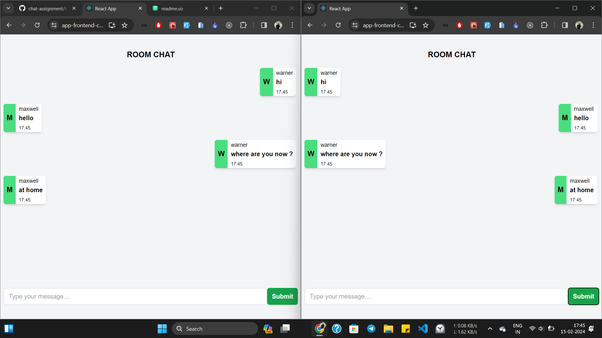

# Chat-app Assingment of Wordlecup.io


## Installation

Install my-project with npm

```bash
  npm install tastybites
  cd   tastybites
```
```bash
  npm run start
```
    
## Tech Stack

**Tech :** React, Redux, TailwindCSS , socket.io


## Features

- creating a chat application using Socket.io on the frontend, with ReactJS, and on the server-side,  using Node.js.

- When a user visits the app, they can add their username and join a chat room. Inside the chat room, they can send messages to communicate with other users who are also in the same room.

- also i  implement a smooth scroll bar to enhance the user experience, making it easier for users to navigate through the chat history.


## Deploy link 


[Deploy link - wait for few minutes](https://app-frontend-chat.onrender.com)

## Screenshots







## prajwal raut this side 👍

[my linkedien](https://www.linkedin.com/in/prajwal-raut29)
